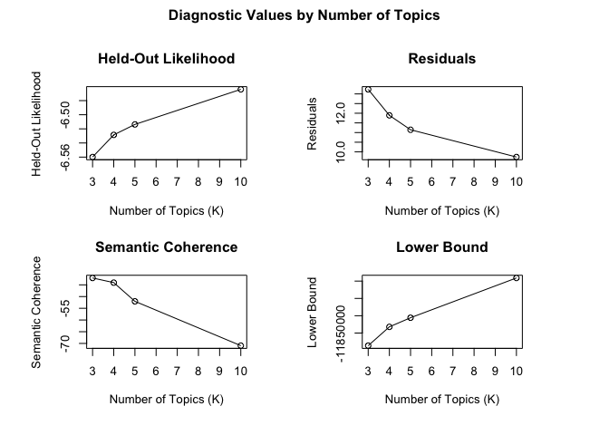
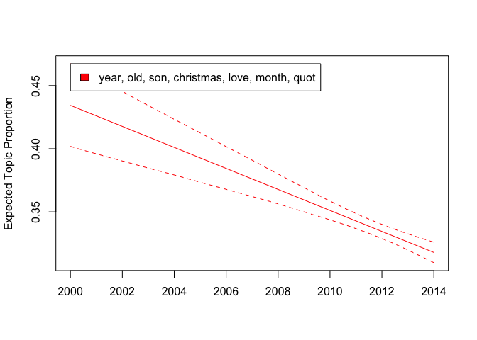
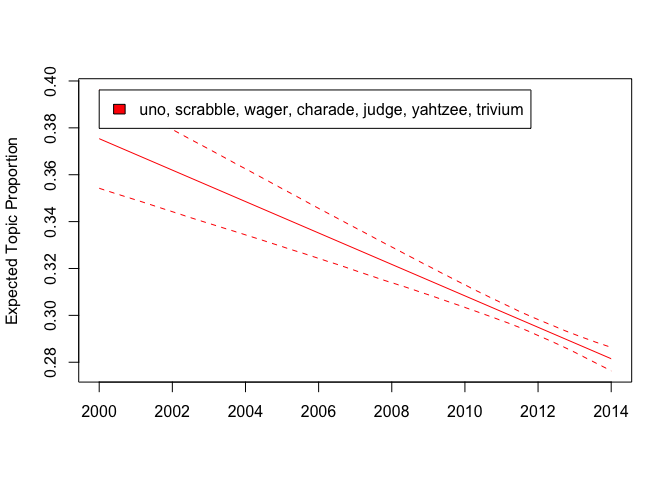
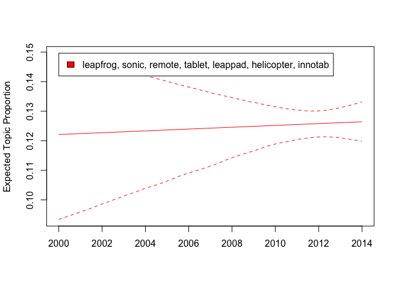
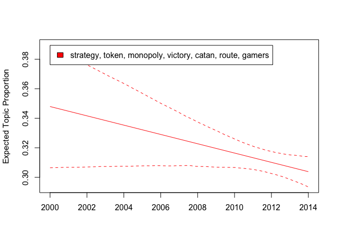

This project is about Amazon toys & games review data. The dataset can
be found at <https://jmcauley.ucsd.edu/data/amazon/>. We performed
sentiment analysis and topic models on games related views. We got
sentiment score for each customer’s review. We only showed 200 customer
sentiment score for this project. Then we found out the optimal number
for qll the topics within 25000 customer reviews. Finally, we conducted
the time series between 2000 and 2014 to see how the number of topics
changed within 10 years.

## Load package

``` r
# Load the package required to read JSON files.
library(rjson)
library(reticulate)
library(dplyr)
```

    ## 
    ## Attaching package: 'dplyr'

    ## The following objects are masked from 'package:stats':
    ## 
    ##     filter, lag

    ## The following objects are masked from 'package:base':
    ## 
    ##     intersect, setdiff, setequal, union

``` r
library(sentimentr)
library(lexicon)
```

    ## 
    ## Attaching package: 'lexicon'

    ## The following object is masked from 'package:sentimentr':
    ## 
    ##     available_data

``` r
library(magrittr)
library(stringr)

use_python("/Users/Caspar/Library/r-miniconda/envs/r-reticulate/bin/python")
```

## Load data

``` python
#py_install("pandas")
import pandas as pd 
import gzip

def parse(path):
  g = gzip.open(path, 'rb')
  for l in g:
    yield eval(l)

def getDF(path):
  i = 0
  df = {}
  for d in parse(path):
    df[i] = d
    i += 1
  return pd.DataFrame.from_dict(df, orient='index')

tg_review = getDF('/Users/Caspar/Downloads/reviews_Toys_and_Games_5.json.gz')
```

## Python to R Format

``` r
df2 <- py$tg_review
```

## Data Cleaning

``` r
tg_review_r <- df2[,c("reviewerName","reviewText","overall","summary","reviewTime")] # select columns
tg_review_r$reviewerName <- unlist(tg_review_r$reviewerName) # unlist reviewer name

# adjust review time format 
tg_review_r$reviewTime <- str_replace_all(tg_review_r$reviewTime,"([0-9]{2})\\s([0-9]{1,2}),\\s([0-9]{4})",
                                       "\\3-\\2-\\1") 
tg_review_r$reviewTime <- str_replace_all(tg_review_r$reviewTime,"-([0-9])-", "-0\\1-")

tg_review_r$reviewTime  <- str_replace_all(tg_review_r$reviewTime,"([0-9]{4})-([0-9]{2})-([0-9]{2})",
                                       "\\1-\\3-\\2")
```

``` r
# Extract reviews related to Game 
matches<- str_detect(tg_review_r$reviewText,"[Gg]ame.?") 
game_df <- tg_review_r[which(matches),]

# Exact reviews except puzzles out of the game_df subset
matches_2 <- str_detect(game_df$reviewText,"[Pp]uzzle")
board_game_df <- game_df[-which(matches_2),]
```

## Text Cleaning

``` r
library(stringr)
library(tidyr)
```

    ## 
    ## Attaching package: 'tidyr'

    ## The following object is masked from 'package:magrittr':
    ## 
    ##     extract

``` r
boardGames_review <- board_game_df 

boardGames_review$reviewText <- str_to_lower(boardGames_review$reviewText) # lower letters  

head(boardGames_review$reviewText) 
```

    ## [1] "we were thrilled to find acquire finally; my husband grew up loving this game. ordered it for my brother.  the game requires strategy, planning, and never ends the same way.  it is a classic, must-have addition for any game closet.  it's a little more time intensive, and the board isn't as flashy as newer games, but hey -- it is exciting to play.  it's all about the acquisitions."                                                                                                                                                                                                                                                                                                                                                                                                                                                                                                                                                                                                                                                                                                                                                                                                                                                                                                                                                                                                                                                                                                                                                                                                                                                                                                                                                                                                                                                                                                                                                                                                                                                                                                                                                                                                                                                                                                                                                                                                                                                                                                                                                                                                                                                                                                                                                                                                                                                                                                                                                                                                                                                                                                                                                                                                                                                                                                                                                                                                                                                                                                                                                                                                                                                                                                                                                                                                                                                                                                                                                                                                                                                                                                                                                                                                                                                                                                                                                                                                                                                                                                                                                                                                                                                                                                                                                                                                                                                                                                                                                                                                                                                                                                                                                                                                                                                                                                                                                                                                                                                                                                                                                                                                                                                                                                                                                                                                                                                                                                                                                                                                                                                                                                                                                                                                                                                                                                                                                                                                                                                                                                                                                                                                                                                                                                                                                                                                                                                                                                                                                                                                                                                                                                                                                                                                                                                                                                                                                                                                                                                                                                                                                                                                                                                                                                                                                                                                                                                                                                                                                                                                                                                                                                                                                                                                                                                                                                                          
    ## [2] "if you have never played, don't let the reviews turn you off. this is a wonderful, mind working game.many people liked the version with the 3-d peices because they don't get bumped... but if you play on a table and aren't trying to hold a baby at the same time or have a cat that likes to jump on games (which are valid concerns), then this version will do fine. i'm not really certain why some people keep buying each version, unless they collect or their old one is worn out from many a good time.i personally have been waiting for a \"flat\"version. i found that the 3-d version was unnecessarily bulky (they could have made a better \"locking system\" if they wanted a bump free version), the pieces were too big to throw into a drawstring bag and draw from (i'd rather not have to turn them all upside down and then make room for all the bulky upside down pieces to take up half my table), and the peices were too bulky to easily conceal from the other players.. we had to all get shoe boxes, or keep them upside down and remember exactly which pieces we had.so all and all, i actually prefer this one. you will have a distinct advantage if you have the type of mind that can keep track of how many of what each player buys.not the best to play with young players because decisions they make can effect everyone else... which is good if they fully understand why they are doing it and what effect it will have, but if they don't, then it really is a bummer when they mess things up for you (and it doesn't even help them)."                                                                                                                                                                                                                                                                                                                                                                                                                                                                                                                                                                                                                                                                                                                                                                                                                                                                                                                                                                                                                                                                                                                                                                                                                                                                                                                                                                                                                                                                                                                                                                                                                                                                                                                                                                                                                                                                                                                                                                                                                                                                                                                                                                                                                                                                                                                                                                                                                                                                                                                                                                                                                                                                                                                                                                                                                                                                                                                                                                                                                                                                                                                                                                                                                                                                                                                                                                                                                                                                                                                                                                                                                                                                                                                                                                                                                                                                                                                                                                                                                                                                                                                                                                                                                                                                                                                                                                                                                                                                                                                                                                                                                                                                                                                                                                                                                                                                                                                                                                                                                                                                                                                                                                                                                                                                                                                                                                                                                                                                                                                                                                                                                                                                                                                                                                                                                                                                                                                                                                                                                                                                                                                                                                                                                                                                                                                                                                                                                                                                                                                                                                                                                                                                                                                                 
    ## [3] "whenever i see this game on my shelf, i get a disturbing visual of quark's big head from star trek: deep space nine. i then picture him playing tongo with a bunch of other ferengi...a game that deals with buying, selling, acquiring, and other things you'd normally see on the wall street floor. don't ask me why...i haven't had my coffee yet this morning.acquire: 3-6 players, ages 12+, average play time: 60 to 90 minutes*note: while the box says that the game is for three to six players, i don't see why a two player variant couldn't exist...if one doesn't already. i'm fairly confident that two players with an imagination who are not concerned about following the rulebook to the letter could make do. i also came across the older avalon hill version's rulebook and there is a section for special rules for two players...so feel free to experiment.acquire plays a bit differently than the other games i've played. the closest comparison i could possibly make to what i've already reviewed is airlines europe. in both games, you're buying stock and whoever has more of certain stocks / colors often reaps the biggest reward when payouts occur. more on that in a minute.version & componentsthe version of acquire i purchased is the latest print of the game, by wizards of the coast.i need to get this pet peeve of mine out of the way before i begin. the player tile trays are made of fairly cheap cardboard that you have to punch out and bend to make the pieces assemble. in other words, i had a fun time trying to assemble the player tile trays. in most games i've purchased, tile trays came assembled and were of much better quality.some people may not mind the extra work and the game is fairly cheaper than your average euro-style board game, but c'mon...would it have hurt profits that much to just make the components a little better? also, the player reference tables were part of the manual itself that i had to cut / tear out. for ocd people like me, the manual just doesn't look right now that pages look torn out of it. i don't see why they couldn't have printed reference sheets separate of the manual.previous versions of the game were much nicer looking and of better quality, so much in fact that other reviewers recommend trying to find those older printed versions as opposed to this one. i don't mind average to poor production values if the price is right, but this is just pushing it.game mechanicsthe game board is made of up of squares that form a grid, going from 1a in the upper left hand corner all the way to 12i in the lower right hand corner. to the left of the grid are the available corporations that players can form and to the right is the same reference chart you'll find in the cutouts in the back of the manual.in acquire, turns are fairly simple. players place a tile, players buy up to three stocks, and finally players pick up a new tile from the supply. tiles correspond to the squares / grid on the board...for example...you'd place the 1a tile if you had it onto the 1a square on the board / grid.when a player places a tile next to an existing tile sitting by itself, that player gets to form a corporation. it doesn't become their's mind you, but they do get a free stock card for establishing it. that player can choose any of the available corporations...though some grow differently than others. some corporations are cheap to buy stocks for early on but don't pay out as much when they grow in size while others are expensive to buy stocks for early on but payout is big in the endgame.players continue placing tiles, forming / growing corporations, and buying stock cards until a tile is placed that causes two corporations to bump heads. this is the real meat and potatoes of the game. a few things happen when this occurs.1) the larger corporation acquires or \"eats up\" the smaller one. if the purple corporation for example had six tiles and green had three tiles, purple would acquire green. the exception to the rule is if both corporations are eleven tiles are higher in size. corporations with eleven tiles or more are considered \"safe.\"2) the player who owns the most stock cards in the company that was acquired gains the one time majority shareholder bonus. the amount varies depending on how big the corporation actually is. the player who owns the second most stock cards of the company that was acquired receives the one time minority shareholder bonus. sorry, but there isn't a prize here for third place, unless there is a tie for second place.3) players who own stock in the company that was acquired have a choice to make.- they can sell their stock for cash now, the amount depending on how big the corporation is.- they can trade that stock on a 2 to 1 basis for stock of the company that acquired it.- they can keep their stock, hoping the corporation will form again down the line.the acquired company marker gets put back to its place on the side of the board and can be formed again later on.at the end of the game, shareholder bonuses are given out to the companies that are on the board and their stocks are traded in for cash. the winner is the player with the most money after that is all said and done.the reviewall three kids joined me to form a four player game. explaining the rules wasn't as bad as i thought it would be. i was concerned that the whole buying stocks and acquiring would overwhelm the eleven year old, but ironically he ended up winning the game. he randomly bought stock so that he'd try to have more than everyone else, which ended up working out to his advantage unbeknownst to him.i focused on buying stocks for two corporations in the middle of the board and would have made a lot of money had one acquired the other...but they ended up becoming \"safe\" and i didn't have much money left to buy stocks in other corporations that could still be acquired. i received a nice bonus at the end of the game for all the stock i had, but my son used the money he earned from his acquisitions to buy even more stock than what i had bought up cheaply in the beginning of the game...so he ended up getting the majority shareholder bonus anyway. he earned so much from a particular acquisition that he just started buying out all of the stock cards of particular colors until there were none left.it seems to pay to have money throughout the game and not to focus on one or two corporations, unless you are sure they will pay out. i was tempted to offer him a later bed time if he'd slip me ten grand, but i thought better of it. the game took us about two hours to play...keep in mind, there was a learning curve and three kids of varying ages involved.overall, i really enjoyed the game. acquire is simple enough to learn but deep enough that players can form strategies in order to outdo the other. the random tile placement throughout the game by players keeps the replayability high. i quickly forgot about the quality of the player tile trays when i started playing out scenarios in my head on how certain corporations might play out on the board.the kids were actively working out aloud which corporations they planned to grow and were constantly comparing how many stock cards they had of certain colors. they were often on the edge of their seats when a merger occured...anxious to see how it would play out. the older ones took it a step further and bought out stock in the growing corporations, recognizing how much money they could make when it grows even bigger. the younger one just bought what he could afford and random chance worked in his favor. they all stated that they enjoyed playing the game.i personally recommend acquire if you enjoy games with a financial theme to them, in this case, stocks and money. i recommend that players have a calculator handy, especially for the endgame. the poor production values (when compared to versions previous to it) might turn some people off, but i'd recommend putting that aside in your mind to enjoy the game for what it really is."
    ## [4] "not that great a game. have only played like once or twice and don't even know where it is now."                                                                                                                                                                                                                                                                                                                                                                                                                                                                                                                                                                                                                                                                                                                                                                                                                                                                                                                                                                                                                                                                                                                                                                                                                                                                                                                                                                                                                                                                                                                                                                                                                                                                                                                                                                                                                                                                                                                                                                                                                                                                                                                                                                                                                                                                                                                                                                                                                                                                                                                                                                                                                                                                                                                                                                                                                                                                                                                                                                                                                                                                                                                                                                                                                                                                                                                                                                                                                                                                                                                                                                                                                                                                                                                                                                                                                                                                                                                                                                                                                                                                                                                                                                                                                                                                                                                                                                                                                                                                                                                                                                                                                                                                                                                                                                                                                                                                                                                                                                                                                                                                                                                                                                                                                                                                                                                                                                                                                                                                                                                                                                                                                                                                                                                                                                                                                                                                                                                                                                                                                                                                                                                                                                                                                                                                                                                                                                                                                                                                                                                                                                                                                                                                                                                                                                                                                                                                                                                                                                                                                                                                                                                                                                                                                                                                                                                                                                                                                                                                                                                                                                                                                                                                                                                                                                                                                                                                                                                                                                                                                                                                                                                                                                                                                         
    ## [5] "great game, not stale... kept us busy and entertained. no two games is ever the same... we enjoyed it for sure."                                                                                                                                                                                                                                                                                                                                                                                                                                                                                                                                                                                                                                                                                                                                                                                                                                                                                                                                                                                                                                                                                                                                                                                                                                                                                                                                                                                                                                                                                                                                                                                                                                                                                                                                                                                                                                                                                                                                                                                                                                                                                                                                                                                                                                                                                                                                                                                                                                                                                                                                                                                                                                                                                                                                                                                                                                                                                                                                                                                                                                                                                                                                                                                                                                                                                                                                                                                                                                                                                                                                                                                                                                                                                                                                                                                                                                                                                                                                                                                                                                                                                                                                                                                                                                                                                                                                                                                                                                                                                                                                                                                                                                                                                                                                                                                                                                                                                                                                                                                                                                                                                                                                                                                                                                                                                                                                                                                                                                                                                                                                                                                                                                                                                                                                                                                                                                                                                                                                                                                                                                                                                                                                                                                                                                                                                                                                                                                                                                                                                                                                                                                                                                                                                                                                                                                                                                                                                                                                                                                                                                                                                                                                                                                                                                                                                                                                                                                                                                                                                                                                                                                                                                                                                                                                                                                                                                                                                                                                                                                                                                                                                                                                                                                                         
    ## [6] "acquire may not be as old as monopoly, but it is older than me and i can see why it's a classic.  finally, an economic game that is far better than monopoly could ever hope to be!  i know a lot of people who have owned older versions are upset at the quality of the components compared to earlier versions and rightly so, but really, the game just rocks!  buy this cheaper version to play, and then go buy an older expensive version to store in your closet, so you can be an acquire snob saying you have version 19xx something:-)acquire is a game about investing in hotel chains and getting the most money in the end, similar to monopoly, but that is about where the similarity ends.  the game does a wonderful job of creating the experience of investing in stock, simulating growth in value as the hotel chain grows, merging, and fighting to be primary stockholder for huge payouts on mergers.  the gameplay is brilliantly simple, but the strategy and decision making can go way deep!  it is done in such a way that the word elegance comes to mind. even though there is luck involved in the way you draw tiles for this game, i at least get to choose where i want to move by placing a tile. whereas in monopoly, you have to move where the die tells you (roll 'n move) which aggravates me.in this game you perform 3 simple actions: place a tile, buy up to three stocks, and then draw another tile. when i place a tile, i can decide if i want help grow a hotel chain(don't have to own it), create a hotel chain, or merge a hotel chain.  after that, i have to decide on which hotel chain on the board i want to buy stock.  this is where things get interesting, because you know that if you own the most stock in a hotel chain that gets gobbled up in a merger, you'll get some major moolah.  of course the bigger the chain is when it gets gobbled, the bigger the payout is. so, you may finding yourself trying to weigh out when you should merge the hotel chain if someone doesn't do it first and whether or not you grow it.  again, there's a risk involved, because if a hotel chain gets beyond 11 tiles, it is safe from acquisition.  if that happens and you're a major stockholder, then you'll keep growing that \"safe\" hotel chain for the big payout at the end of the game.  when mergers happen, you also have to decide if you should trade your stock in for the new hotel, sell your old stock, or keep it for when you decide to start the old chain back up again.  the game has a lot of subtle strategy as you try to weigh out how you grow a hotel chain or merge it, based on how much stock you own in it or how much someone else has invested in it.acquire is just a beautifully designed game and is a lot of fun to play.  this is a great way to teach your kids about investing in stock too!"

### Stem Text

``` r
library(tm)
```

    ## Loading required package: NLP

``` r
stem_bg <- tm::stemDocument(boardGames_review$reviewText) # stem document

documentsCorp <- tm::SimpleCorpus(VectorSource(stem_bg)) #simple corpus document

documentsDTM <- DocumentTermMatrix(documentsCorp) # get document matrix

inspect(documentsDTM) 
```

    ## <<DocumentTermMatrix (documents: 24507, terms: 116231)>>
    ## Non-/sparse entries: 1908547/2846564570
    ## Sparsity           : 100%
    ## Maximal term length: 484
    ## Weighting          : term frequency (tf)
    ## Sample             :
    ##        Terms
    ## Docs    and are for game play that the this with you
    ##   11218  50  15  46   34   10   21 159   22   34  49
    ##   15337  24  40  42   31   25   22 120   54   33  57
    ##   15784  78  26  44   23    3   24 158   19   31  43
    ##   17358  76  26  25   46   33   20 220   14   17  36
    ##   19309  60  22  37    1    3   37 141   11   15  24
    ##   21521  83  27  21   36    7   25 135   20   24  51
    ##   22785  53  12  40   25    3   23  99   21   17  26
    ##   618    65  22  24   25   20   31  86   26   10  60
    ##   9731  175   1  45   13    0   50 430   15   52   0
    ##   9898   63  20  27   38    6   15 155   12   26  14

### Lemmatize Text

``` r
library(textstem)
```

    ## Loading required package: koRpus.lang.en

    ## Loading required package: koRpus

    ## Loading required package: sylly

    ## For information on available language packages for 'koRpus', run
    ## 
    ##   available.koRpus.lang()
    ## 
    ## and see ?install.koRpus.lang()

    ## 
    ## Attaching package: 'koRpus'

    ## The following object is masked from 'package:tm':
    ## 
    ##     readTagged

``` r
boardGames_review$reviewText <- lemmatize_strings(boardGames_review$reviewText) # lemmatize strings
```

## Sentiment Analysis (Lexicon: Jockers)

``` r
# just show 200 sentiment scores as example
library(sentimentr)
jocker_bg <- sentiment(get_sentences(boardGames_review$reviewText[1:200]), 
                       polarity_dt = lexicon::hash_sentiment_jockers) # use jockers as lexicon

jocker_bg_summary <- jocker_bg%>%
  group_by(element_id)%>%      
  summarize(meanSentiment =mean(sentiment))
```

    ## `summarise()` ungrouping output (override with `.groups` argument)

``` r
boardGames_review$element_id = 1:nrow(boardGames_review) # get a new element id column

boardGames_review_sub200 <- left_join(boardGames_review[1:200,], jocker_bg_summary, by = "element_id") # left join

boardGames_review_sub200 <- boardGames_review_sub200[order(-boardGames_review_sub200$meanSentiment),] # order by mean sentiment scores

head(boardGames_review_sub200$reviewText) # show first five observations
```

    ## [1] "i love this game, it's a great intro to euro - style board game. it's easy enough to understand, but it's complex and deep enough to satisfy the adult as good." 
    ## [2] "this game be easy to learn and be a fun game especially if you like train as we do. a game of strategy and teach child to learn to think ahead."                 
    ## [3] "game strike right balance between simplicity for ease of learn and complexity for replayability. a very enjoyable game to play."                                 
    ## [4] "feel like a strategic train route game. i really enjoy play with my friend and family. really good buy. love it"                                                 
    ## [5] "very much enjoy this game as there be a lot go on. it's intelligent, good think out, and a lot of fun to play."                                                  
    ## [6] "ticket to ride be easy to learn, fairly quick to play. it be a great gateway game from traditional american game into the ( to me ) much fun world of euro game."

## Topic Models

``` r
library(stm)
```

    ## stm v1.3.6 successfully loaded. See ?stm for help. 
    ##  Papers, resources, and other materials at structuraltopicmodel.com

``` r
set.seed(1001)

holdoutRows <- sample(1:nrow(boardGames_review), 100, replace = FALSE) # set holdout samples for future validation

# get the data exclude hold out rows
reviewText <- textProcessor(documents = boardGames_review$reviewText[-c(holdoutRows)], 
                          metadata = boardGames_review[-c(holdoutRows), ], 
                          stem = FALSE) 
```

    ## Building corpus... 
    ## Converting to Lower Case... 
    ## Removing punctuation... 
    ## Removing stopwords... 
    ## Removing numbers... 
    ## Creating Output...

``` r
# prep documents
reviewPrep <- prepDocuments(documents = reviewText$documents, 
                               vocab = reviewText$vocab,
                               meta = reviewText$meta)
```

    ## Removing 13481 of 27954 terms (13481 of 1307754 tokens) due to frequency 
    ## Your corpus now has 24407 documents, 14473 terms and 1294273 tokens.

``` r
# plot K with pre-defined values
kTest <- searchK(documents = reviewPrep$documents, 
             vocab = reviewPrep$vocab, 
             K = c(3,4,5,10), verbose = FALSE)   

plot(kTest)
```

<!-- -->

Looks like four topics are the best choice due to highest semantic
coherence (how well the words connected together) and lower residuals.

``` r
# set k = 4 And get 4 topics
topics4 <- stm(documents = reviewPrep$documents, 
             vocab = reviewPrep$vocab, seed = 1001,
             K = 4, verbose = FALSE)
```

``` r
plot(topics4)
```

<!-- -->

Topic 1 has over 40% of expected topic proportions and topic 2, 3, and 4
occupy 20% each. We can see the labels in each topic.

``` r
labelTopics(topics4)
```

    ## Topic 1 Top Words:
    ##       Highest Prob: game, card, player, much, play, can, good 
    ##       FREX: dungeon, pilot, dominion, worker, victory, munchkin, hex 
    ##       Lift: -ages, admiral, advanture, aegs, afar, agenda, algorithm 
    ##       Score: player, expansion, card, dominion, strategy, deck, victory 
    ## Topic 2 Top Words:
    ##       Highest Prob: game, play, card, can, fun, much, one 
    ##       FREX: wager, charade, scrabble, uno, judge, yahtzee, quelf 
    ##       Lift: adverb, aficionado, alienate, antoinette, applesthe, argumentative, arizona 
    ##       Score: card, player, game, rule, family, play, question 
    ## Topic 3 Top Words:
    ##       Highest Prob: game, play, old, love, year, kid, fun 
    ##       FREX: granddaughter, grandson, grandchild, christmas, math, niece, birthday 
    ##       Lift: fam, itis, mcstuffin, recommed, abbys, absolutly, actingout 
    ##       Score: old, kid, love, daughter, year, game, son 
    ## Topic 4 Top Words:
    ##       Highest Prob: can, much, good, toy, use, one, get 
    ##       FREX: dart, nerf, app, articulation, install, iphone, device 
    ##       Lift: acceleration, accesories, accordian, airsoft, alt, appcenter, articulate 
    ##       Score: toy, leappad, app, battery, camera, tablet, leapfrog

Highest means that words have the highest probability of occurring
within the topic. The lift was calculated by dividing by frequencies and
log frequencies computed score. We will focus on the FREX words because
of those words that frequently occur within the topic. They are also
exclusive to the topic only, which will be useful for us to
differentiate all topics from each other

We can get a closer look at the names for each topic:

``` r
thoughts_4 <- findThoughts(topics4, texts = reviewPrep$meta$reviewText, n = 1)
```

``` r
head(topics4$theta)
```

    ##            [,1]       [,2]       [,3]       [,4]
    ## [1,] 0.30614938 0.38063935 0.27802669 0.03518458
    ## [2,] 0.03682991 0.57511958 0.10161880 0.28643171
    ## [3,] 0.76305593 0.11990174 0.06468260 0.05235972
    ## [4,] 0.04359460 0.31538507 0.55384259 0.08717774
    ## [5,] 0.04634684 0.29515706 0.59142687 0.06706923
    ## [6,] 0.84197871 0.06964528 0.07738178 0.01099424

We found that Doc 1 has a probability of 68.85% for belonging to topic
2. Doc 5 has a probability of 34.10%, 46.76% for belonging to topic 1
and 2. We can pull the original review out and see

``` r
board_game_df[1,'reviewText']
```

    ## [1] "We were thrilled to find Acquire finally; my husband grew up loving this game. Ordered it for my brother.  The game requires strategy, planning, and never ends the same way.  It is a classic, must-have addition for any game closet.  It's a little more time intensive, and the board isn't as flashy as newer games, but hey -- it is exciting to play.  It's all about the acquisitions."

``` r
board_game_df[5,'reviewText']
```

    ## [1] "great game, not stale... kept us busy and entertained. No two games is ever the same... We enjoyed it for sure."

``` r
reviewPrep$meta[1, ]
```

    ##   reviewerName
    ## 1        Betsy
    ##                                                                                                                                                                                                                                                                                                                                                                  reviewText
    ## 1 we be thrill to find acquire finally; my husband grow up love this game. order it for my brother. the game require strategy, plan, and never end the same way. it be a classic, must - have addition for any game closet. it's a little much time intensive, and the board isn't as flashy as new game, but hey - - it be excite to play. it's all about the acquisition.
    ##   overall               summary reviewTime element_id
    ## 1       5 one of the best games 2013-05-08          1

``` r
reviewPrep$meta[5, ]
```

    ##   reviewerName
    ## 5         Drew
    ##                                                                                                   reviewText
    ## 5 great game, not stale... keep us busy and entertain. no two game be ever the same... we enjoy it for sure.
    ##   overall      summary reviewTime element_id
    ## 5       5 entertaining 2013-02-04          5

We can also see what terms are in documents 1 and document 5:

``` r
reviewPrep$documents[[1]]
```

    ##      [,1] [,2] [,3] [,4] [,5] [,6] [,7] [,8] [,9] [,10] [,11] [,12] [,13] [,14]
    ## [1,]  118  119  160 1331 1559 2160 2220 4053 4297  4627  4631  4708  5064  5494
    ## [2,]    1    1    1    1    1    1    1    1    1     1     1     1     4     1
    ##      [,15] [,16] [,17] [,18] [,19] [,20] [,21] [,22] [,23] [,24] [,25] [,26]
    ## [1,]  5836  6073  6506  6664  7337  7438  8230  8279  8429  8434  8823  9444
    ## [2,]     1     1     1     1     1     1     1     1     1     1     1     1
    ##      [,27] [,28] [,29] [,30] [,31] [,32]
    ## [1,]  9472 10553 12251 12901 12968 14015
    ## [2,]     1     1     1     1     1     1

``` r
reviewPrep$vocab[reviewPrep$documents[[1]][1, ]]
```

    ##  [1] "acquire"     "acquisition" "addition"    "board"       "brother"    
    ##  [6] "classic"     "closet"      "end"         "excite"      "finally"    
    ## [11] "find"        "flashy"      "game"        "grow"        "hey"        
    ## [16] "husband"     "intensive"   "isnt"        "little"      "love"       
    ## [21] "much"        "must"        "never"       "new"         "order"      
    ## [26] "plan"        "play"        "require"     "strategy"    "thrill"     
    ## [31] "time"        "way"

``` r
reviewPrep$vocab[reviewPrep$documents[[5]][1, ]]
```

    ##  [1] "busy"      "enjoy"     "entertain" "ever"      "game"      "great"    
    ##  [7] "keep"      "stale"     "sure"      "two"

## Prediction sentiment scores for holdout samples

``` r
newReviewText <- textProcessor(documents = boardGames_review$reviewText[holdoutRows], 
                          metadata = boardGames_review[holdoutRows, ], 
                          stem = FALSE) # use holdout rows to build test data
```

    ## Building corpus... 
    ## Converting to Lower Case... 
    ## Removing punctuation... 
    ## Removing stopwords... 
    ## Removing numbers... 
    ## Creating Output...

``` r
newReviewCorp <- alignCorpus(new = newReviewText, old.vocab = topics4$vocab)
```

    ## Your new corpus now has 100 documents, 1669 non-zero terms of 1759 total terms in the original set. 
    ## 90 terms from the new data did not match.
    ## This means the new data contained 11.5% of the old terms
    ## and the old data contained 94.9% of the unique terms in the new data. 
    ## You have retained 6732 tokens of the 6828 tokens you started with (98.6%).

``` r
newReviewFitted <- fitNewDocuments(model = topics4, documents = newReviewCorp$documents, 
                newData = newReviewCorp$meta, origData = reviewPrep$meta)
```

    ## ....................................................................................................

``` r
newReviewFitted$theta[1:10,]  # print out 10 samples probabilities for each topic 
```

    ##             [,1]       [,2]      [,3]       [,4]
    ##  [1,] 0.45677290 0.19631375 0.1852424 0.16167092
    ##  [2,] 0.15747634 0.72253806 0.1051876 0.01479803
    ##  [3,] 0.01382934 0.02627644 0.2210813 0.73881287
    ##  [4,] 0.08194197 0.50269301 0.3668761 0.04848896
    ##  [5,] 0.09235351 0.68007520 0.1848554 0.04271587
    ##  [6,] 0.38676099 0.09399372 0.1958227 0.32342263
    ##  [7,] 0.02474704 0.20152859 0.7085023 0.06522205
    ##  [8,] 0.03294169 0.63310673 0.2930435 0.04090813
    ##  [9,] 0.04689642 0.09870762 0.4670619 0.38733407
    ## [10,] 0.02654043 0.10749679 0.7090574 0.15690541

## Time Series Topic Model Analysis

``` r
# clean the data 
clean_boardGames_review <- boardGames_review%>%
  mutate( 
         reviewText = str_replace_all(reviewText, "\n", " "),  # get rid of space  
         reviewText = str_replace_all(reviewText, "(\\[.*?\\])", ""),  # get rid of stuff in []
         reviewText = str_squish(reviewText), # reduce repeated white space
         reviewText = gsub("([a-z])([A-Z])", "\\1 \\2", reviewText), # small letter followed by capital letter
         reviewText = tolower(reviewText), # lower text
         reviewText = removeWords(reviewText, c("’", stopwords(kind = "en"))),  # remove stop words
         reviewText = removePunctuation(reviewText), # remove punctuation
         reviewText = removeNumbers(reviewText), # remove numbers
         reviewText = textstem::lemmatize_strings(reviewText),  # lemmatize text
         year = lubridate::year(reviewTime)) # extract year out of date column
```

``` r
# text processor
predictorText <- textProcessor(documents = clean_boardGames_review$reviewText, 
                          metadata = clean_boardGames_review, 
                          stem = FALSE)
```

    ## Building corpus... 
    ## Converting to Lower Case... 
    ## Removing punctuation... 
    ## Removing stopwords... 
    ## Removing numbers... 
    ## Creating Output...

``` r
# prep documents
reviewPrep <- prepDocuments(documents = predictorText$documents, 
                               vocab = predictorText$vocab,
                               meta = predictorText$meta)
```

    ## Removing 12847 of 26862 terms (12847 of 1279237 tokens) due to frequency 
    ## Your corpus now has 24507 documents, 14015 terms and 1266390 tokens.

``` r
# stm documents with K = 4 
topicPredictor <- stm(documents = reviewPrep$documents,
             vocab = reviewPrep$vocab, prevalence = ~ year,
             data = reviewPrep$meta, K = 4, verbose = FALSE)

# year effect
yearEffect <- estimateEffect(1:4 ~ year, stmobj = topicPredictor,
               metadata = reviewPrep$meta)

# print summary statistics and p values
summary(yearEffect, topics = c(1:4))
```

    ## 
    ## Call:
    ## estimateEffect(formula = 1:4 ~ year, stmobj = topicPredictor, 
    ##     metadata = reviewPrep$meta)
    ## 
    ## 
    ## Topic 1:
    ## 
    ## Coefficients:
    ##               Estimate Std. Error t value Pr(>|t|)    
    ## (Intercept) -1.855e+01  1.614e+00  -11.49   <2e-16 ***
    ## year         9.305e-03  8.022e-04   11.60   <2e-16 ***
    ## ---
    ## Signif. codes:  0 '***' 0.001 '**' 0.01 '*' 0.05 '.' 0.1 ' ' 1
    ## 
    ## 
    ## Topic 2:
    ## 
    ## Coefficients:
    ##               Estimate Std. Error t value Pr(>|t|)    
    ## (Intercept) 13.7898833  1.7804752   7.745 9.92e-15 ***
    ## year        -0.0067073  0.0008849  -7.579 3.60e-14 ***
    ## ---
    ## Signif. codes:  0 '***' 0.001 '**' 0.01 '*' 0.05 '.' 0.1 ' ' 1
    ## 
    ## 
    ## Topic 3:
    ## 
    ## Coefficients:
    ##               Estimate Std. Error t value Pr(>|t|)  
    ## (Intercept) -3.2857538  1.7372698  -1.891   0.0586 .
    ## year         0.0017984  0.0008635   2.083   0.0373 *
    ## ---
    ## Signif. codes:  0 '***' 0.001 '**' 0.01 '*' 0.05 '.' 0.1 ' ' 1
    ## 
    ## 
    ## Topic 4:
    ## 
    ## Coefficients:
    ##               Estimate Std. Error t value Pr(>|t|)    
    ## (Intercept)  9.0189334  1.6371404   5.509 3.65e-08 ***
    ## year        -0.0043822  0.0008137  -5.386 7.28e-08 ***
    ## ---
    ## Signif. codes:  0 '***' 0.001 '**' 0.01 '*' 0.05 '.' 0.1 ' ' 1

<!-- --><!-- --><!-- --><!-- -->

   In topic 1, customers talked about dominion, dungeon and knight. And this topic trend has been increased by 15% between 2000 and 2014. The number of topics belonging to topic 2 in traditional board games, including scrabble, Uno, and Yahtzee, has decreased from 40% to 28% between 2000 and 2014. We can guess grandparents are the ones who wrote these comments/reviews bought some games as birthday or Christmas gift for their grandson and granddaughter from the words in topic 3. The number of topic 3 trend overall has increased a little bit to 35% in 2014 compared to 30% in 2000. The number of topics belonging to topic 4 went to another direction of tradional games that requires device and iPhone. Surprisingly, the number of topic 4 trend also decreased by 6% between 2000 and 2014.
