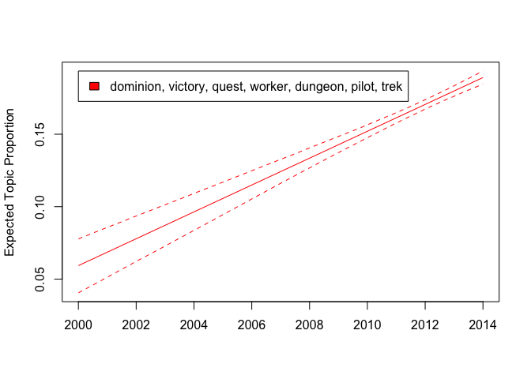
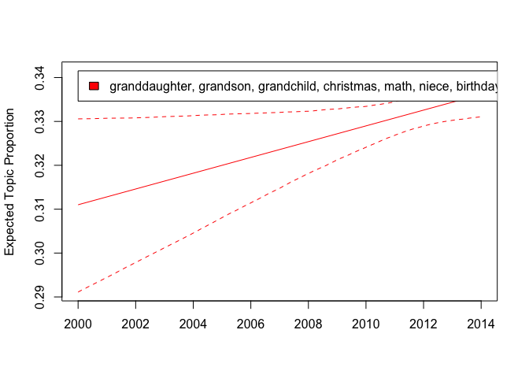
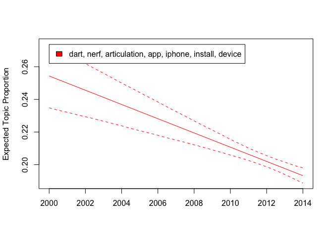

``` r
# Load the package required to read JSON files.
library(rjson)
library(reticulate)
library(dplyr)
```

    ## 
    ## Attaching package: 'dplyr'

    ## The following objects are masked from 'package:stats':
    ## 
    ##     filter, lag

    ## The following objects are masked from 'package:base':
    ## 
    ##     intersect, setdiff, setequal, union

``` r
library(sentimentr)
library(lexicon)
```

    ## 
    ## Attaching package: 'lexicon'

    ## The following object is masked from 'package:sentimentr':
    ## 
    ##     available_data

``` r
library(magrittr)
library(stringr)

use_python("/Users/Caspar/Library/r-miniconda/envs/r-reticulate/bin/python")
```

## Load data

``` python
#py_install("pandas")
import pandas as pd 
import gzip

def parse(path):
  g = gzip.open(path, 'rb')
  for l in g:
    yield eval(l)

def getDF(path):
  i = 0
  df = {}
  for d in parse(path):
    df[i] = d
    i += 1
  return pd.DataFrame.from_dict(df, orient='index')

tg_review = getDF('/Users/Caspar/Downloads/reviews_Toys_and_Games_5.json.gz')


tg_review
```

    ##             reviewerID        asin  ... unixReviewTime   reviewTime
    ## 0       A1VXOAVRGKGEAK  0439893577  ...     1390953600  01 29, 2014
    ## 1        A8R62G708TSCM  0439893577  ...     1395964800  03 28, 2014
    ## 2       A21KH420DK0ICA  0439893577  ...     1359331200  01 28, 2013
    ## 3        AR29QK6HPFYZ4  0439893577  ...     1391817600   02 8, 2014
    ## 4        ACCH8EOML6FN5  0439893577  ...     1399248000   05 5, 2014
    ## ...                ...         ...  ...            ...          ...
    ## 167592  A18Q24BZK2CB5P  B00LBI9BKA  ...     1404691200   07 7, 2014
    ## 167593  A1I8ON1X0B2N2W  B00LBI9BKA  ...     1404691200   07 7, 2014
    ## 167594  A3V24H5350ULKI  B00LBI9BKA  ...     1404777600   07 8, 2014
    ## 167595  A1W2F1WI0QZ4AJ  B00LBI9BKA  ...     1405641600  07 18, 2014
    ## 167596   AV6WVMUJVUHNB  B00LBI9BKA  ...     1405382400  07 15, 2014
    ## 
    ## [167597 rows x 9 columns]

## Python format to R format

``` r
df2 <- py$tg_review
```

``` r
tg_review_r <- df2[,c("reviewerName","reviewText","overall","summary","reviewTime")]
tg_review_r$reviewerName <- unlist(tg_review_r$reviewerName)

tg_review_r$reviewTime <- str_replace_all(tg_review_r$reviewTime,"([0-9]{2})\\s([0-9]{1,2}),\\s([0-9]{4})",
                                       "\\3-\\2-\\1")
tg_review_r$reviewTime <- str_replace_all(tg_review_r$reviewTime,"-([0-9])-", "-0\\1-")

                                          
tg_review_r$reviewTime  <- str_replace_all(tg_review_r$reviewTime,"([0-9]{4})-([0-9]{2})-([0-9]{2})",
                                       "\\1-\\3-\\2")
```

## Board Games dataset

``` r
matches<- str_detect(tg_review_r$reviewText,"[Bb]oard.?")

board_game_df <- tg_review_r[which(matches),]
```

## Text Cleaning

``` r
library(stringr)
library(tidyr)
```

    ## 
    ## Attaching package: 'tidyr'

    ## The following object is masked from 'package:magrittr':
    ## 
    ##     extract

``` r
boardGames_review <- board_game_df

boardGames_review$reviewText <- str_to_lower(boardGames_review$reviewText)

head(boardGames_review$reviewText)
```

    ## [1] "both sides are magnetic.  a real plus when you're entertaining more than one child.  the four-year old can find the letters for the words, while the two-year old can find the pictures the words spell.  (i bought letters and magnetic pictures to go with this board).  both grandkids liked it a lot, which means i like it a lot as well.  have not even introduced markers, as this will be used strictly as a magnetic board."                                                                                                                                                  
    ## [2] "this is a nice magnetic board for the kids to carry around and play with the letter bought additional magnetic pieces from mellissa and doug to increase thier play time with them hope it works"                                                                                                                                                                                                                                                                                                                                                                                      
    ## [3] "i keep this board on top of the hallway table so that i can quickly write notes (which won't get lost until i erase them) and it folds down neatly so it's easy to hide when company calls.  i also like the size -- not too big and not too small.  quality magnets hold pretty good but i use it mainly for notes. note:  children's alphabet letters don't hold very well - they tend to slide."                                                                                                                                                                                    
    ## [4] "bought this board along with melissa and doug wood and magnetic letters and numbers kit.  the size is great for my 2-year-old grandson to play with, and there are 2 sides to use.  this is a big hit in my home and will grow with children as they become more creative...great learning tool too.  i also bought a container of magnetic foam objects so we can work with his spelling as he has now mastered his letters and numbers.  i believe it is also compatible with dry-erase markers for older children.  i highly recommend this board...great size to travel with also."
    ## [5] "the board had to be put away for my 18 month old grand daughter and we used just the refrigerator for the alphabet intending to bring back the board when she got a little older. the wooden letters are not painted, but rather covered with a colored paper which becomes loose rather easily. most of the letters lasted for about 2 months before i had to throw them all out. fortunately she knows all her alphabet by name and we are using other means to teach her how to put them together into words. at age 2 she can now spell her name - molly."                         
    ## [6] "sturdy and perfect for coffee table. magnets stick easily and it's great for 2 sided products. plus, you can use dry erase on the board for when they get a bit older. good product"

### Stem text

``` r
library(tm)
```

    ## Loading required package: NLP

``` r
stem_bg <- tm::stemDocument(boardGames_review$reviewText)

documentsCorp <- tm::SimpleCorpus(VectorSource(stem_bg))

documentsDTM <- DocumentTermMatrix(documentsCorp)

inspect(documentsDTM)
```

    ## <<DocumentTermMatrix (documents: 9023, terms: 80510)>>
    ## Non-/sparse entries: 982464/725459266
    ## Sparsity           : 100%
    ## Maximal term length: 153
    ## Weighting          : term frequency (tf)
    ## Sample             :
    ##       Terms
    ## Docs   and are for game have that the this with you
    ##   1083  57  22  16   14    8   17 182   10   18  10
    ##   262   65  22  24   25   26   31  86   26   10  60
    ##   3878 175   1  45   13    6   50 430   15   52   0
    ##   4975  96   7  17    2    7   39  91    3   18   0
    ##   5606  42  11  18    0   10   34 182   38   24   4
    ##   5717  24  40  42   31   21   22 120   54   33  57
    ##   5760  94  20  43   16   24   43 195   23   29  43
    ##   6670  76  26  25   46   17   20 220   14   17  36
    ##   7295  60  22  37    1   11   37 141   11   15  24
    ##   8044  83  27  21   36   27   25 135   20   24  51

### lemmatize text

``` r
library(textstem)
```

    ## Loading required package: koRpus.lang.en

    ## Loading required package: koRpus

    ## Loading required package: sylly

    ## For information on available language packages for 'koRpus', run
    ## 
    ##   available.koRpus.lang()
    ## 
    ## and see ?install.koRpus.lang()

    ## 
    ## Attaching package: 'koRpus'

    ## The following object is masked from 'package:tm':
    ## 
    ##     readTagged

``` r
boardGames_review$reviewText <- lemmatize_strings(boardGames_review$reviewText)
```

### sentiment analysis

``` r
library(sentimentr)
jocker_bg <- sentiment(get_sentences(boardGames_review$reviewText[1:200]), polarity_dt = lexicon::hash_sentiment_jockers)

jocker_bg_summary <- jocker_bg%>%
  group_by(element_id)%>%      
  summarize(meanSentiment =mean(sentiment))
```

    ## `summarise()` ungrouping output (override with `.groups` argument)

``` r
boardGames_review$element_id = 1:nrow(boardGames_review)

boardGames_review_sub200 <- left_join(boardGames_review[1:200,], jocker_bg_summary, by = "element_id")

boardGames_review_sub200 <- boardGames_review_sub200[order(-boardGames_review_sub200$meanSentiment),] 

head(boardGames_review_sub200$reviewText)
```

    ## [1] "i love this game, it's a great intro to euro - style board game. it's easy enough to understand, but it's complex and deep enough to satisfy the adult as good."                                                                                                                                                                                                                                                       
    ## [2] "love the theme of the puzzle as i can teach my child about real life animal; definitely of educational value. the puzzle's quality be quite strong and seem pretty durable as it be make from a thick cardboard. wish the puzzle come along with a 'trace - along' fold piece so that it can be easy for a toddler to manage on their own. overall, a fun, educational and colourful puzzle for any child."            
    ## [3] "i be new to dungeon & dragon concept so i want something fairly simple that i can play with kid. i love this game because it: - be easy to understand from good manual - piece and board be of good quality - it come with over dozen of adventure story - with adult around even kid as young as 7 year can learn it pretty quickly - because you can combine piece in any manner you can create your own game easily"
    ## [4] "we be settler of catan board game fan through and through, but we need something that be comparable in fun so we can take a break from catan. this be perfect. it be very easy to learn and very easy to teach to newcomer. the game play be also very simple ( but you use a lot of strategy as good ). ticket to ride also have a few small expansion that we love as good!"                                         
    ## [5] "very nice puzzle. i love the big piece, and the durable cardboard. my 3 yo really like it. mudpuppy puzzle be good quality and the design be cute."                                                                                                                                                                                                                                                                    
    ## [6] "my husband and i enjoy play board game with friend and have find that this be a great game to teach beginner / intermediate player. it do have a good amount of strategy, but the rule be much simple than some other strategy game so it be easy to get the hang of it the first time you play."

## Topic Models

``` r
library(stm)
```

    ## stm v1.3.6 successfully loaded. See ?stm for help. 
    ##  Papers, resources, and other materials at structuraltopicmodel.com

``` r
set.seed(1001)

holdoutRows <- sample(1:nrow(boardGames_review), 100, replace = FALSE)

reviewText <- textProcessor(documents = boardGames_review$reviewText[-c(holdoutRows)], 
                          metadata = boardGames_review[-c(holdoutRows), ], 
                          stem = FALSE)
```

    ## Building corpus... 
    ## Converting to Lower Case... 
    ## Removing punctuation... 
    ## Removing stopwords... 
    ## Removing numbers... 
    ## Creating Output...

``` r
reviewPrep <- prepDocuments(documents = reviewText$documents, 
                               vocab = reviewText$vocab,
                               meta = reviewText$meta)
```

    ## Removing 10289 of 21762 terms (10289 of 679101 tokens) due to frequency 
    ## Your corpus now has 8923 documents, 11473 terms and 668812 tokens.

``` r
kTest <- searchK(documents = reviewPrep$documents, 
             vocab = reviewPrep$vocab, 
             K = c(3,4,5,10), verbose = FALSE)   # K = c(3, 4, 5, 10, 20)

plot(kTest)
```

<!-- -->

Looks like four topics are the best choice

``` r
topics4 <- stm(documents = reviewPrep$documents, 
             vocab = reviewPrep$vocab, seed = 1001,
             K = 4, verbose = FALSE)
```

``` r
plot(topics4)
```

<!-- -->

``` r
labelTopics(topics4)
```

    ## Topic 1 Top Words:
    ##       Highest Prob: set, good, can, plastic, use, much, one 
    ##       FREX: chalk, easel, crayon, crayola, erase, chalkboard, lego 
    ##       Lift: aft, allen, americana, aquarelle, asap, avenger, awning 
    ##       Score: doll, easel, chalk, crayon, erase, lego, marker 
    ## Topic 2 Top Words:
    ##       Highest Prob: can, much, toy, use, one, get, letter 
    ##       FREX: app, keyboard, leapfrog, sonic, download, piano, leappad 
    ##       Lift: download, -mb, aas, abbreviation, accordian, adams, adapter 
    ##       Score: sonic, toy, battery, keyboard, app, innotab, leapfrog 
    ## Topic 3 Top Words:
    ##       Highest Prob: piece, old, play, love, year, puzzle, board 
    ##       FREX: puzzle, jigsaw, cookie, oven, thomas, kitchen, basketball 
    ##       Lift: acorn, appliance, applique, backsplash, barium, bilibos, blueberry 
    ##       Score: puzzle, toy, piece, doug, melissa, kitchen, old 
    ## Topic 4 Top Words:
    ##       Highest Prob: game, play, card, player, much, board, can 
    ##       FREX: strategy, token, monopoly, opponent, victory, catan, route 
    ##       Lift: abyss, accrue, adaptability, adhd, adrenaline, adrenalineradio, adultplaying 
    ##       Score: game, player, card, strategy, rule, expansion, win

``` r
thoughts_4 <- findThoughts(topics4, texts = reviewPrep$meta$reviewText, n = 1)
```

``` r
head(topics4$theta, 15)
```

    ##             [,1]       [,2]      [,3]       [,4]
    ##  [1,] 0.11056584 0.27549951 0.5638720 0.05006267
    ##  [2,] 0.07999318 0.12231229 0.7249857 0.07270888
    ##  [3,] 0.56488983 0.14388995 0.2625485 0.02867167
    ##  [4,] 0.16492701 0.14903997 0.6664035 0.01962948
    ##  [5,] 0.14019666 0.26174586 0.5756016 0.02245591
    ##  [6,] 0.44422197 0.02891452 0.5012881 0.02557540
    ##  [7,] 0.14241084 0.22100443 0.5926826 0.04390216
    ##  [8,] 0.24635476 0.15151976 0.5667803 0.03534513
    ##  [9,] 0.08398334 0.29258730 0.5649774 0.05845196
    ## [10,] 0.22934983 0.14565795 0.5066526 0.11833957
    ## [11,] 0.31457171 0.06611851 0.5971557 0.02215405
    ## [12,] 0.07947045 0.02563969 0.8651595 0.02973036
    ## [13,] 0.24867450 0.04034703 0.6690334 0.04194508
    ## [14,] 0.12146192 0.02073470 0.8398628 0.01794056
    ## [15,] 0.05467746 0.01298791 0.9211755 0.01115911

We found that Doc 14 has a probability of 81.6% for belonging to topic 5
and let’s pull the original review out and see

``` r
board_game_df[14,'reviewText']
```

    ## [1] "I appreciate the materials used to create this puzzle and our three year-old loves the picture that is formed when the puzzle is complete. Soy inks + recycled cardboard = Wonderful.I have only one criticism, and it's a minor one. Since the puzzle is intended for a younger audience, it might be nice if the pieces were a bit thicker. Our son has good fine motor skills, but the pieces can still bend and crease as he works to fit them together. With that said however, the creasing may be due more to his impatience when the pieces don't seem to fit right than with the build quality of the puzzle."

``` r
tail(topics4$theta, 15)
```

    ##               [,1]        [,2]       [,3]       [,4]
    ## [8909,] 0.17932955 0.285611781 0.51315895 0.02189971
    ## [8910,] 0.83911625 0.020123625 0.12099271 0.01976742
    ## [8911,] 0.64227364 0.045901249 0.29827016 0.01355495
    ## [8912,] 0.83402390 0.043401809 0.10829743 0.01427686
    ## [8913,] 0.01066646 0.005822944 0.04883761 0.93467299
    ## [8914,] 0.13270296 0.015408700 0.11722998 0.73465836
    ## [8915,] 0.16482517 0.466356235 0.34277428 0.02604432
    ## [8916,] 0.21898462 0.536951979 0.23006677 0.01399663
    ## [8917,] 0.33167597 0.403887313 0.24903094 0.01540578
    ## [8918,] 0.15149815 0.146179719 0.68981943 0.01250270
    ## [8919,] 0.23365551 0.179853939 0.57326150 0.01322906
    ## [8920,] 0.40043981 0.260755404 0.27349471 0.06531008
    ## [8921,] 0.74373249 0.042518559 0.20168253 0.01206642
    ## [8922,] 0.58541814 0.035634232 0.36595285 0.01299478
    ## [8923,] 0.21014529 0.558834953 0.21631736 0.01470240

Doc 8913 has a probability of 84.1% for belonging to topic 1

``` r
board_game_df[8913,'reviewText']
```

    ## [1] "I grew up loving to play with Barbies.  I loved them so much that my father made me a wooden case just to hold mine safely and I still have them to this day.  I also grew up playing with \"Fashion Plates\" a drawing and stencil kit that allowed you to \"make fashions\" that you could color and texture with several variations.  I was hoping this Barbie might be as much fun.She isn't.First there are only six pieces of clothing that you can \"iron\" the stickers that come with this onto.  This limited canvas on which to press the stickers is very annoying on two levels -- the first is simply that you don't have many clothes to use it on but perhaps you could apply them to other clothes, the second is that some of the tops are patterned and that looks a bit off with the stickers.Be wary of the packaging - yes the cardboard can be recycled as can the bigger outer plastic shell but that's where the good packaging ends.  There were so many tiny attachment points for this thing and so many plastic tabs to maneuver that I got five scratches opening it.  I can't imagine a child safely opening it, in fact I wouldn't let a child try to open it at all.But the most annoying thing about this is by having a set of stickers and no blank sticker material you are immediately limiting the creativity of the child.  This is not designing anything, it is merely adding stickers and once that's done, you are done and this doll becomes like any other Barbie.Apparently I can't add my own photos to show you the problems I found."

``` r
reviewPrep$meta[14, ]
```

    ##                 reviewerName
    ## 14 Adam B. Shaeffer "ashaef"
    ##                                                                                                                                                                                                                                                                                                                                                                                                                                                                                                                                                                                            reviewText
    ## 14 i appreciate the material use to create this puzzle and our three year - old love the picture that be form when the puzzle be complete. soy ink + recycle cardboard = wonderful. i have only one criticism, and it's a minor one. since the puzzle be intend for a young audience, it may be nice if the piece be a bite thick. our son have good fine motor skill, but the piece can still bend and crease as he work to fit them together. with that say however, the crease may be due much to his impatience when the piece don't seem to fit right than with the build quality of the puzzle.
    ##    overall        summary reviewTime element_id
    ## 14       4 A good product 2013-01-07         14

``` r
reviewPrep$meta[8913, ]
```

    ##                                   reviewerName
    ## 8913 Andrionni Ribo "Amateur Critical Analyst"
    ##                                                                                                                                                                                                                                                                                                                                                                                                                                                                                                                                                                                                                                                                                                                                                                                                                                                                                                                                                                                                                                                                                                                                                                                                                                                                                                                                                                                                                                                                                                                                                                                                                                                                                                                                                                                                                                                                                                                                                                                                                                                                                                                                                                                                                                                                reviewText
    ## 8913 this game be currently run as a spiel de jahres nominee for 2014 ( a prestigious german award for boardgames ) and i pick up this game because of that, and i must say this game be quite wonderful from 2 to 4 player. - overview - the goal be to be the first person to 15 victory point which trigger the end of the game. player ultimately spend their turn either collect gem or purchase development card with collect gem. development card always impart bonus of certain gem color. this bonus color reduce the cost of future development card far accelerate the game to the end. certain card also contain prestige point, but they aren't as easy to attain initially and require some careful plan. be careful, though, as gem can run in short supply or a much need card get purchase or reserve for your opponent before you can get to it. as a add goal, optional noble tile be available to all and get additional point to that who have the right combination of development card. - component quality - the component of this game be quite superb. the art be beautiful to look at in this game. beautifully illustrate with excellent clear color and shape. i really enjoy the quality of the chip. remind me of poker chip. perhaps make of clay? it have a very nice heft to it, and there's a nice thud which add some character to this game. the card be also of very good stock with white border to its backing. they'll last for a bite. the bonus noble tile be a nice thick cardboard. the insert of the box hold everything quite good. absolutely no shortcut in quality. - criticism - the theme of this game be almost paste on. it doesn't matter really as everything else mention elevate this game and be still fun. - overall - overall, i enjoy this game a lot. easy to explain with a large amount of depth. a game that have the potential to be quite fun for all age and all experience. my friend who never play board game this past decade love it and will probably buy a copy. i, myself, who have game of all type and play all sort of game find this a excellent addition and play to my collection and a really strong contender in this year's nominee. quite a splendid game.; - ) highly recommend.
    ##      overall
    ## 8913       5
    ##                                                                                 summary
    ## 8913 A Great, Mechanically Straight-Forward Game of Gem Collecting. Wow. Such Splendor.
    ##      reviewTime element_id
    ## 8913 2014-05-26       9013

We can also see what terms are in documents 14:

``` r
reviewPrep$documents[[14]]
```

    ##      [,1] [,2] [,3] [,4] [,5] [,6] [,7] [,8] [,9] [,10] [,11] [,12] [,13] [,14]
    ## [1,]  484  660  940 1011 1291 1403 1453 1966 2272  2273  2305  2936  3041  3740
    ## [2,]    1    1    1    1    1    1    1    1    2     1     1     1     1     1
    ##      [,15] [,16] [,17] [,18] [,19] [,20] [,21] [,22] [,23] [,24] [,25] [,26]
    ## [1,]  3774  3920  4292  4818  4945  5111  5178  5890  6099  6119  6319  6487
    ## [2,]     2     1     1     1     1     1     1     1     1     2     1     1
    ##      [,27] [,28] [,29] [,30] [,31] [,32] [,33] [,34] [,35] [,36] [,37] [,38]
    ## [1,]  6519  6695  6890  6905  7408  7412  7951  7966  8188  8504  8738  8870
    ## [2,]     1     1     1     2     1     3     4     1     1     1     1     1
    ##      [,39] [,40] [,41] [,42] [,43] [,44] [,45] [,46] [,47] [,48] [,49] [,50]
    ## [1,]  9114  9156  9345  9386  9650 10169 10208 10301 10830 11307 11326 11398
    ## [2,]     1     1     1     1     1     1     1     1     1     1     1     1
    ##      [,51]
    ## [1,] 11424
    ## [2,]     1

``` r
reviewPrep$vocab[reviewPrep$documents[[14]][1, ]]
```

    ##  [1] "appreciate" "audience"   "bend"       "bite"       "build"     
    ##  [6] "can"        "cardboard"  "complete"   "crease"     "create"    
    ## [11] "criticism"  "dont"       "due"        "fine"       "fit"       
    ## [16] "form"       "good"       "however"    "impatience" "ink"       
    ## [21] "intend"     "love"       "material"   "may"        "minor"     
    ## [26] "motor"      "much"       "nice"       "old"        "one"       
    ## [31] "picture"    "piece"      "puzzle"     "quality"    "recycle"   
    ## [36] "right"      "say"        "seem"       "since"      "skill"     
    ## [41] "son"        "soy"        "still"      "thick"      "three"     
    ## [46] "together"   "use"        "wonderful"  "work"       "year"      
    ## [51] "young"

``` r
reviewPrep$vocab[reviewPrep$documents[[8913]][1, ]]
```

    ##   [1] "absolutely"  "accelerate"  "add"         "addition"    "additional" 
    ##   [6] "age"         "almost"      "also"        "always"      "amount"     
    ##  [11] "arent"       "art"         "attain"      "available"   "award"      
    ##  [16] "backing"     "beautiful"   "beautifully" "bite"        "board"      
    ##  [21] "boardgames"  "bonus"       "border"      "box"         "buy"        
    ##  [26] "can"         "card"        "cardboard"   "careful"     "certain"    
    ##  [31] "character"   "chip"        "clay"        "clear"       "collect"    
    ##  [36] "collection"  "color"       "combination" "component"   "contain"    
    ##  [41] "contender"   "copy"        "cost"        "criticism"   "currently"  
    ##  [46] "decade"      "depth"       "development" "doesnt"      "easy"       
    ##  [51] "either"      "elevate"     "else"        "end"         "enjoy"      
    ##  [56] "everything"  "excellent"   "experience"  "explain"     "far"        
    ##  [61] "find"        "first"       "friend"      "fun"         "future"     
    ##  [66] "game"        "gem"         "german"      "get"         "goal"       
    ##  [71] "good"        "heft"        "highly"      "hold"        "illustrate" 
    ##  [76] "initially"   "insert"      "jahres"      "large"       "last"       
    ##  [81] "look"        "lot"         "love"        "make"        "matter"     
    ##  [86] "mention"     "much"        "must"        "need"        "never"      
    ##  [91] "nice"        "noble"       "nominee"     "opponent"    "optional"   
    ##  [96] "overall"     "overview"    "past"        "paste"       "perhaps"    
    ## [101] "person"      "pick"        "plan"        "play"        "player"     
    ## [106] "point"       "poker"       "potential"   "prestige"    "prestigious"
    ## [111] "probably"    "purchase"    "quality"     "quite"       "really"     
    ## [116] "recommend"   "reduce"      "remind"      "require"     "reserve"    
    ## [121] "right"       "run"         "say"         "shape"       "short"      
    ## [126] "shortcut"    "sort"        "spend"       "spiel"       "splendid"   
    ## [131] "still"       "stock"       "strong"      "superb"      "supply"     
    ## [136] "theme"       "theres"      "theyll"      "thick"       "though"     
    ## [141] "thud"        "tile"        "trigger"     "turn"        "type"       
    ## [146] "ultimately"  "victory"     "white"       "will"        "wonderful"  
    ## [151] "years"

## Prediction sentiment scores for holdout samples

``` r
newReviewText <- textProcessor(documents = boardGames_review$reviewText[holdoutRows], 
                          metadata = boardGames_review[holdoutRows, ], 
                          stem = FALSE)
```

    ## Building corpus... 
    ## Converting to Lower Case... 
    ## Removing punctuation... 
    ## Removing stopwords... 
    ## Removing numbers... 
    ## Creating Output...

``` r
newReviewCorp <- alignCorpus(new = newReviewText, old.vocab = topics4$vocab)
```

    ## Your new corpus now has 100 documents, 2177 non-zero terms of 2359 total terms in the original set. 
    ## 182 terms from the new data did not match.
    ## This means the new data contained 19.0% of the old terms
    ## and the old data contained 92.3% of the unique terms in the new data. 
    ## You have retained 9836 tokens of the 10044 tokens you started with (97.9%).

``` r
newReviewFitted <- fitNewDocuments(model = topics4, documents = newReviewCorp$documents, 
                newData = newReviewCorp$meta, origData = reviewPrep$meta)
```

    ## ....................................................................................................

``` r
newReviewFitted$theta[1:10,]
```

    ##             [,1]       [,2]       [,3]       [,4]
    ##  [1,] 0.42054239 0.02167696 0.15704170 0.40073895
    ##  [2,] 0.04108597 0.08923354 0.43137604 0.43830445
    ##  [3,] 0.10210228 0.64345973 0.18625860 0.06817940
    ##  [4,] 0.08072182 0.02568311 0.68188353 0.21171154
    ##  [5,] 0.14547568 0.02464434 0.20957414 0.62030583
    ##  [6,] 0.01260009 0.01199076 0.36419434 0.61121482
    ##  [7,] 0.02041095 0.88519978 0.04335185 0.05103742
    ##  [8,] 0.03773545 0.09238298 0.84981507 0.02006650
    ##  [9,] 0.30239589 0.11728915 0.56868493 0.01163004
    ## [10,] 0.02214576 0.16983662 0.20591476 0.60210287

``` r
clean_boardGames_review <- boardGames_review%>%
  mutate( 
         reviewText = str_replace_all(reviewText, "\n", " "),   
         reviewText = str_replace_all(reviewText, "(\\[.*?\\])", ""),
         reviewText = str_squish(reviewText), 
         reviewText = gsub("([a-z])([A-Z])", "\\1 \\2", reviewText), 
         reviewText = tolower(reviewText), 
         reviewText = removeWords(reviewText, c("’", stopwords(kind = "en"))), 
         reviewText = removePunctuation(reviewText), 
         reviewText = removeNumbers(reviewText),
         reviewText = textstem::lemmatize_strings(reviewText), 
         year = lubridate::year(reviewTime))
```

``` r
predictorText <- textProcessor(documents = clean_boardGames_review$reviewText, 
                          metadata = clean_boardGames_review, 
                          stem = FALSE)
```

    ## Building corpus... 
    ## Converting to Lower Case... 
    ## Removing punctuation... 
    ## Removing stopwords... 
    ## Removing numbers... 
    ## Creating Output...

``` r
reviewPrep <- prepDocuments(documents = predictorText$documents, 
                               vocab = predictorText$vocab,
                               meta = predictorText$meta)
```

    ## Removing 9777 of 20980 terms (9777 of 668613 tokens) due to frequency 
    ## Your corpus now has 9023 documents, 11203 terms and 658836 tokens.

``` r
topicPredictor <- stm(documents = reviewPrep$documents,
             vocab = reviewPrep$vocab, prevalence = ~ year,
             data = reviewPrep$meta, K = 4, verbose = FALSE)


yearEffect <- estimateEffect(1:4 ~ year, stmobj = topicPredictor,
               metadata = reviewPrep$meta)

summary(yearEffect, topics = c(1:4))
```

    ## 
    ## Call:
    ## estimateEffect(formula = 1:4 ~ year, stmobj = topicPredictor, 
    ##     metadata = reviewPrep$meta)
    ## 
    ## 
    ## Topic 1:
    ## 
    ## Coefficients:
    ##              Estimate Std. Error t value Pr(>|t|)    
    ## (Intercept) 17.113018   2.715719   6.301 3.09e-10 ***
    ## year        -0.008339   0.001350  -6.178 6.78e-10 ***
    ## ---
    ## Signif. codes:  0 '***' 0.001 '**' 0.01 '*' 0.05 '.' 0.1 ' ' 1
    ## 
    ## 
    ## Topic 2:
    ## 
    ## Coefficients:
    ##               Estimate Std. Error t value Pr(>|t|)    
    ## (Intercept) -22.335807   2.858077  -7.815 6.11e-15 ***
    ## year          0.011215   0.001421   7.895 3.24e-15 ***
    ## ---
    ## Signif. codes:  0 '***' 0.001 '**' 0.01 '*' 0.05 '.' 0.1 ' ' 1
    ## 
    ## 
    ## Topic 3:
    ## 
    ## Coefficients:
    ##               Estimate Std. Error t value Pr(>|t|)
    ## (Intercept) -0.5207365  2.3489826  -0.222    0.825
    ## year         0.0003213  0.0011676   0.275    0.783
    ## 
    ## 
    ## Topic 4:
    ## 
    ## Coefficients:
    ##              Estimate Std. Error t value Pr(>|t|)  
    ## (Intercept)  6.840464   3.618158   1.891   0.0587 .
    ## year        -0.003246   0.001798  -1.805   0.0712 .
    ## ---
    ## Signif. codes:  0 '***' 0.001 '**' 0.01 '*' 0.05 '.' 0.1 ' ' 1

``` r
plot.estimateEffect(yearEffect, "year", method = "continuous",
                    model = topicPredictor, topics = 1, labeltype = "frex")
```

<!-- -->

``` r
plot.estimateEffect(yearEffect, "year", method = "continuous",
                    model = topicPredictor, topics = 2, labeltype = "frex")
```

<!-- -->

``` r
plot.estimateEffect(yearEffect, "year", method = "continuous",
                    model = topicPredictor, topics = 3, labeltype = "frex")
```

<!-- -->

``` r
plot.estimateEffect(yearEffect, "year", method = "continuous",
                    model = topicPredictor, topics = 4, labeltype = "frex")
```

<!-- -->
